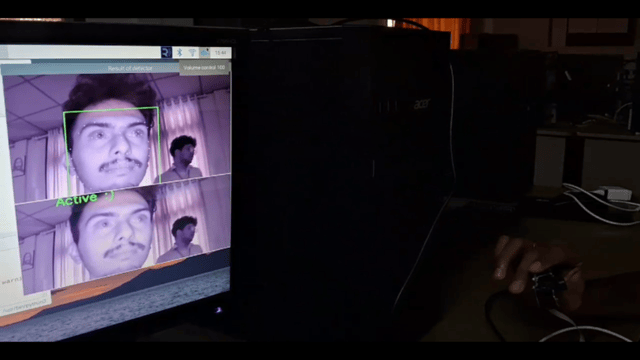
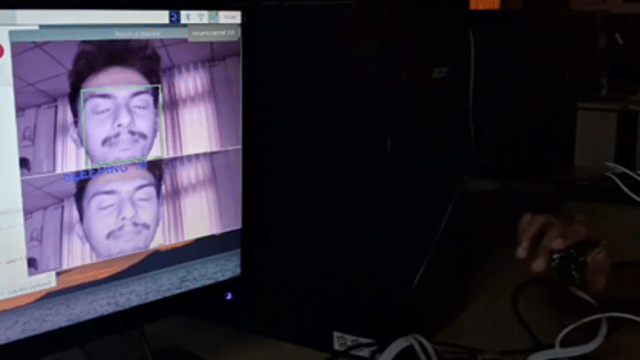

# 🚗 Vigilant Drive - Driver Drowsiness Detection System

**Vigilant Drive** is a real-time driver alertness monitoring system built using **OpenCV**, **Dlib**, and **Raspberry Pi 4** with a **night vision camera**. It detects whether the driver is active, drowsy, or sleeping by analyzing the eye aspect ratio (EAR) using facial landmarks. If the driver is found to be sleeping, an alert sound is triggered to wake them up.

---

## 📷 How It Works

- A night vision camera captures live video of the driver’s face.
- Dlib’s 68-point shape predictor model is used to detect facial landmarks.
- Eye Aspect Ratio (EAR) is computed using the coordinates of the eyes.
- Based on EAR thresholds:
  - 👀 **Active** – Eyes open
  - 😴 **Drowsy** – Eyes partially closed
  - 💤 **Sleeping** – Eyes closed → **Alarm triggered**
- An alert sound is played using `pygame` to wake the driver.

---

## 🧰 Technologies Used

- Python 3
- OpenCV
- Dlib
- NumPy
- Imutils
- Pygame
- Raspberry Pi 4
- Night Vision Camera Module

---

## 📁 Project Structure

```
vigilant-drive/
├── Vigilant_Drive_Code.py # Main Python script
├── wakeup.wav # Alarm audio file
├── Driver_Active.jpg # Sample image: active state
├── Driver_Sleeping.jpg # Sample image: sleeping state
├── Vigilant_Drive_Report.pdf # Project report (PDF)
├── README.md # This file
└── .gitignore
```


---

## 📥 Required Model File

This project requires Dlib’s **68-point facial landmark predictor** file.

👉 [Download shape_predictor_68_face_landmarks.dat.bz2](https://github.com/davisking/dlib-models/raw/master/shape_predictor_68_face_landmarks.dat.bz2)

> After downloading:
> 1. Extract the `.bz2` file using any archive tool (e.g., 7-Zip)
> 2. Place the extracted `shape_predictor_68_face_landmarks.dat` in the same folder as `vigilant_drive.py`

---

## 🔊 Alert Audio

An alert sound (`wakeup.wav`) is included to notify the driver if they are detected sleeping.

> You can replace this with your own custom `.wav` file if needed.

---

## 🖼️ Screenshots

| Driver Active | Driver Sleeping |
|---------------|------------------|
|  |  |

---

## 📄 Project Report

📥 [Click here to view the full project report (PDF)](vigilantdrivefinal.pdf)
You can find the detailed explanation of the system, hardware design, and software logic in the included report:  
📄 `Vigilant_Drive_Report.pdf`

---

## 👨‍💻 Author

- **Ananthu Krishna G**

---

## 📜 License

This project is created for academic and demonstration purposes only.

